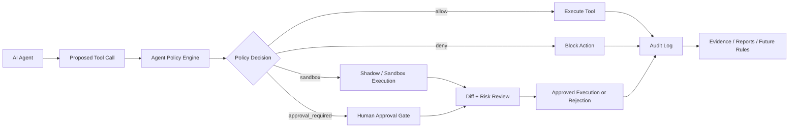
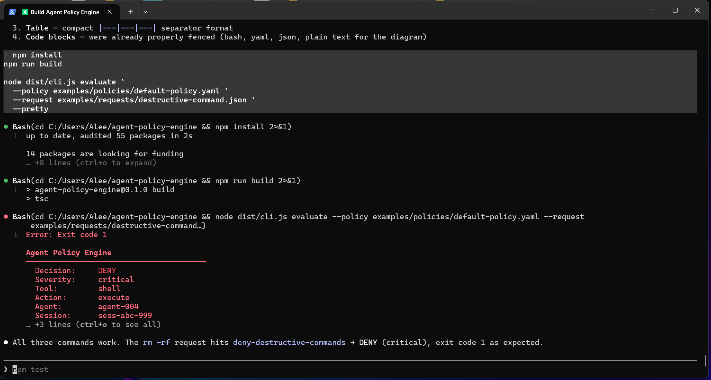
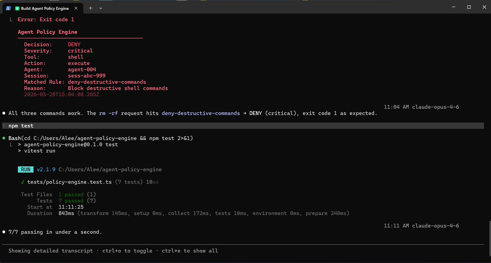

# Aegis Platform

**Security tooling for MCP-powered AI agents.**

Aegis is an agentic security platform for MCP-powered AI agents, starting with Phantom: a scanner that identifies dangerous permissions, weak auth boundaries, tool-chain attack paths, and agentic security misconfigurations before deployment.

The platform is designed around a closed-loop security model:
Attack → Detect → Sandbox → Audit → Improve

Current working module: Phantom
- **Phantom** scans MCP configurations for dangerous permissions, weak auth boundaries, tool-chain attack paths, and agentic security misconfigurations.

  In Progress : Sentinel and Witness
- **Sentinel** monitors runtime behavior, detects policy violations, and can trigger emergency kill-switch workflows.
- **Witness** proxies MCP tool calls through policy checks, shadow execution, diffing, timeline control, and audit trails.

The goal is simple: red-team findings should not sit in a static report. They should become runtime detection rules, sandbox policies, and verifiable evidence.

```text
   Phantom (Attack)          Sentinel (Detect)          Witness (Sandbox)
  ┌──────────────┐         ┌──────────────┐          ┌──────────────┐
  │ MCP Scanner  │────────▶│ Detection    │◀────────▶│ MCP Proxy    │
  │ Tool Graph   │ rules   │ Pipeline     │  events  │ Shadow Exec  │
  │ Auth Probe   │────────▶│ Alerts       │          │ Policy Engine│
  │ STAC Chains  │ policies│ Kill Switch  │          │ Diff Engine  │
  │ LLM Judge    │────────▶│ DLP Hooks    │          │ Timeline Mgr │
  └──────┬───────┘         └──────────────┘          └──────────────┘
         │                                                    │
         └────────────────── Closed Loop ─────────────────────┘
              Findings generate rules, policies, and audit evidence
```

---

## Current Status

Aegis is in active development.

### Implemented / Active

- Monorepo architecture for the Aegis platform
- CLI entry point for MCP configuration scanning
- Phantom security scan workflow
- MCP attack-surface mapping
- Risk scoring and severity output
- JSON and HTML report foundations
- Shared package structure for cross-module types and utilities

### In Progress

- Sentinel runtime detection pipeline
- Witness MCP proxy integration
- Closed-loop rule and policy generation
- Shadow execution workflows
- Audit trail hardening
- Interactive approval flows for risky tool calls

### Planned

- Cryptographically signed audit receipts
- Replay and restore workflows
- Proof Explorer UI
- DeBERTa-based injection detection service
- DLP scanning and secret exposure workflows
- Team policy management
- Compliance-oriented report templates
- Extended support for multi-agent trust testing

---

## Why Aegis

AI agents are gaining access to filesystems, terminals, APIs, databases, browsers, and internal tools. That creates a new security problem: agent behavior is not only about prompt safety anymore. It is about **tool authority, execution boundaries, data movement, runtime monitoring, and auditability**.

Most current approaches focus on one layer:

| Layer | Common Approach | Gap |
|---|---|---|
| Testing | Prompt injection tests, red-team prompts, benchmark suites | Limited visibility into MCP tools, permissions, and tool-chain risk |
| Runtime | Guardrails, filters, monitoring hooks | Often disconnected from offensive findings and sandbox policy |
| Sandboxing | Local isolation, permission prompts, manual review | Limited feedback loop into detection and future testing |
| Auditing | Logs and traces | Often not designed as verifiable security evidence |

Aegis is designed around a closed loop:

1. **Attack the configuration** before deployment.
2. **Detect risky behavior** during runtime.
3. **Sandbox dangerous tool calls** before side effects reach production.
4. **Audit what happened** with evidence that can be reviewed and verified.
5. **Feed real findings back** into stronger tests, rules, and policies.

---

## Quick Start

```bash
# Clone
git clone https://github.com/VisualOps-AI/aegis-platform.git
cd aegis-platform

# Install dependencies
npm install

# Build packages
npx turbo run build

# Scan an MCP configuration
node apps/cli/dist/cli.js scan path/to/mcp-config.json
```

### Example Output

```text
  AEGIS PHANTOM — MCP Agent Security Scanner

  Target:  mcp-config.json
  Modules: all
  Format:  both

  Scanning...

  ┌─────────────────────────────────────┐
  │  Risk Score:  8.3/10                │
  ├─────────────────────────────────────┤
  │  Critical:   10                     │
  │  High:        7                     │
  │  Medium:      2                     │
  │  Low:         0                     │
  ├─────────────────────────────────────┤
  │  Total:      19                     │
  │  Duration:   16ms                   │
  └─────────────────────────────────────┘
```

---

## Architecture

```text
aegis-platform/
├── packages/
│   ├── phantom/          # Offensive MCP red-team engine
│   ├── sentinel/         # Runtime detection and kill-switch workflows
│   ├── witness/          # MCP proxy, shadow execution, and audit trails
│   └── shared/           # Shared types, integrations, and utilities
└── apps/
    └── cli/              # Unified CLI: aegis scan | surface
```

### Policy Decision Flow

How a proposed tool call moves through the policy engine and into the audit trail:



---

## MVP Proof Assets

Concrete evidence that the MVP works end to end: a live scan, a passing test suite, and the machine-readable report shape downstream systems consume.



*CLI scan running against an MCP config and printing the risk-score summary — proves the scanner ingests a real target and produces a scored, severity-bucketed result.*



*Test suite passing — proves the attack modules, OWASP mapping, and report assembly are covered and green.*

**Sample report:** [`examples/sample-scan-output.json`](examples/sample-scan-output.json)

This sample report demonstrates the machine-readable output shape produced by the Aegis scan workflow for automation, dashboards, CI checks, and downstream policy generation.

It mirrors the `ScanReport` type in [`packages/shared/src/types/finding.ts`](packages/shared/src/types/finding.ts): a scan envelope (`id`, `timestamp`, `target`, `duration`), per-module `results`, and a `summary` rolled up by severity, attack category, and OWASP Agentic category with an overall `riskScore`. The findings cover dangerous filesystem access, shared credentials, shell execution risk, and a read-to-network data exfiltration chain, with `sandbox` and `approval_required` remediation guidance where appropriate.

---

## Core Modules

## Phantom — Offensive MCP Red-Team Engine

Phantom ingests MCP configurations and analyzes tool-use boundaries before an agent is deployed.

### Attack Modules

| Module | What It Tests |
|---|---|
| Auth Boundary | Shared credentials, missing authentication, God Key patterns, unrestricted execution |
| Tool Chain / STAC | Dangerous tool combinations such as read → exfiltrate, data → execute, and multi-hop chains |
| Indirect Injection | Poisoned tool responses that may hijack agent behavior |
| Multi-Agent Trust | Sub-agent manipulation, credential leakage, and cross-agent policy bypass |
| Supply Chain | MCP server authenticity, tool description poisoning, and shadow tools |
| Context Poisoning | Multi-turn causality laundering and boundary information leakage |

### Phantom CLI

```bash
aegis scan mcp-config.json                    # Scan with all modules
aegis scan mcp-config.json -m auth-boundary   # Run a specific module
aegis scan mcp-config.json -f html            # Generate HTML report only
aegis scan mcp-config.json -o ./reports       # Custom output directory
aegis scan mcp-config.json -v                 # Verbose output
```

**Exit codes:**

| Code | Meaning |
|---|---|
| 0 | Clean or no high-severity findings |
| 1 | High-severity findings detected |
| 2 | Critical findings detected |

---

## Sentinel — Runtime Detection

Sentinel is the defensive runtime layer for monitoring agent behavior and responding to policy violations.

Planned and in-progress capabilities include:

- Multi-checkpoint security screening pipeline
- Injection and behavior-hijacking detection
- Agent registry and emergency kill-switch workflows
- DLP and credential exposure scanning
- Multi-channel alerting through Slack, PagerDuty, and webhooks
- Rule generation from Phantom findings
- Event ingestion from Witness sandbox activity

Sentinel is designed to answer one question:

> Is this agent still behaving within its authorized operational boundary?

---

## Witness — MCP Sandbox and Audit Layer

Witness is the sandboxing and evidence layer. It proxies MCP tool calls and decides whether to allow, deny, shadow-execute, or escalate actions for approval.

Planned and in-progress capabilities include:

- YAML policy engine with risk scoring
- Copy-on-write shadow workspaces
- Diff engine for file and state changes
- Timeline branching: fork, diff, merge, reject
- SQLite local audit trail
- Interactive approvals for risky tool calls
- Signed receipts for security-relevant actions

Witness is designed to answer one question:

> What did the agent try to do, what changed, and who approved it?

---

## The Closed Loop

Aegis is designed to connect offensive testing, runtime defense, sandbox enforcement, and audit evidence.

```text
1. PHANTOM scans MCP config and finds vulnerabilities
         ↓
2. Findings generate SENTINEL detection rules
   Example: block or alert when shared credentials are detected
         ↓
3. Findings generate WITNESS sandbox policies
   Example: shadow-execute file writes after database reads
         ↓
4. WITNESS captures real agent behavior and emits events
         ↓
5. SENTINEL flags anomalies and can trigger kill-switch workflows
         ↓
6. Audit data feeds back into PHANTOM for adaptive testing
```

This creates a security loop where testing improves runtime defense, and runtime evidence improves future testing.

---

## Reports

Aegis is designed to generate both machine-readable and human-readable security reports.

### JSON Report

Structured output for automation, pipelines, dashboards, and downstream policy generation.

Includes:

- Findings
- Severity levels
- Risk score
- Affected tools
- Attack-chain metadata
- Recommended remediations
- Module statistics

### HTML Report

A professional audit-style report intended for review by technical teams, security leads, and stakeholders.

Includes:

- Risk score dashboard
- Severity-sorted findings
- Attack-chain explanations
- Reproduction steps
- Remediation guidance
- Emerging agentic-security category mapping

---

## Example Use Cases

### 1. Pre-Deployment MCP Security Review

Run Phantom against an MCP configuration before giving an agent access to internal tools.

```bash
aegis scan ./mcp-config.json
```

Use this to identify dangerous permissions, weak auth boundaries, tool-chain risk, and exfiltration paths.

### 2. Runtime Agent Monitoring

Use Sentinel to monitor production agent behavior, detect suspicious activity, and trigger alerts or kill-switch workflows.

Example risks:

- Agent attempts to access unauthorized tools
- Agent chains tools in a dangerous sequence
- Agent leaks credentials or sensitive data
- Agent behavior changes after poisoned tool output

### 3. Sandboxed Tool Execution

Use Witness to intercept MCP tool calls and route risky actions into shadow execution before changes touch the real workspace.

Example workflow:

```text
agent tool call → Witness policy check → shadow workspace → diff → approve/reject → audit trail
```

---

## Security Coverage

Aegis is designed around emerging agentic application risks, including:

| Risk Area | Aegis Module |
|---|---|
| Excessive agency | Phantom, Witness |
| Behavior hijacking | Phantom, Sentinel |
| Tool misuse | Phantom, Witness |
| Identity and credential abuse | Phantom, Sentinel |
| Privilege escalation | Phantom, Witness |
| Data exfiltration | Phantom, Sentinel, Witness |
| Supply-chain risk | Phantom |
| Context manipulation | Phantom, Sentinel |
| Multi-agent trust failures | Phantom, Sentinel |
| Audit evasion | Witness |

---

## Compliance Readiness

Aegis is designed to support evidence generation for AI governance and high-risk AI system review workflows.

Potential compliance-supporting outputs include:

- Adversarial testing reports
- Runtime monitoring events
- Sandbox decision logs
- Approval records
- Security findings and remediations
- Audit-oriented evidence trails

Aegis does not make a system compliant by itself. It provides technical evidence and control workflows that can support broader governance, risk, and compliance programs.

---

## Tech Stack

- **Monorepo:** Turborepo
- **Language:** TypeScript / Node.js 22+
- **Runtime ML services:** Python planned for Sentinel detection workflows
- **MCP:** `@modelcontextprotocol/sdk`
- **LLM:** Claude API for attack generation and judgment workflows
- **Database:** SQLite for local audit trails and scan metadata; PostgreSQL planned for Sentinel runtime services
- **CLI:** Commander.js

---

## Roadmap

### v0.1 — Phantom Scanner Foundation

- MCP configuration ingestion
- Attack-surface mapping
- Auth boundary checks
- Tool-chain risk analysis
- CLI scan command
- JSON and HTML report generation

### v0.2 — Witness Sandbox Foundation

- MCP proxy routing
- YAML policy engine
- Shadow execution
- Diff generation
- Approval/rejection workflow
- Local audit trail

### v0.3 — Sentinel Runtime Detection

- Runtime event ingestion
- Detection rule format
- Alerting hooks
- Kill-switch workflow
- DLP and credential exposure checks

### v0.4 — Closed-Loop Policy Generation

- Phantom findings → Sentinel rules
- Phantom findings → Witness policies
- Witness events → Sentinel detection updates
- Audit evidence → adaptive red-team testing

### v0.5 — Evidence and Verification

- Signed audit receipts
- Receipt verification command
- Replay and restore workflows
- Proof Explorer UI foundations

---

## Design Principles

### 1. Tool-use security over prompt-only security

Agent security is not only about what the model says. It is about what the model can do.

### 2. Default-deny for dangerous capabilities

High-impact tool calls should be denied, sandboxed, or routed through approval.

### 3. Red-team findings should become controls

Security reports should generate runtime rules and sandbox policies, not just recommendations.

### 4. Audit trails should explain decisions

Every important agent action should answer:

- What was attempted?
- What policy evaluated it?
- What risk was assigned?
- What changed?
- Was it allowed, denied, shadowed, or approved?

### 5. Local-first where possible

Security tooling should work in local development environments before requiring enterprise infrastructure.

---

## License

MIT

---

Built by [VisualOps AI](https://github.com/VisualOps-AI)

